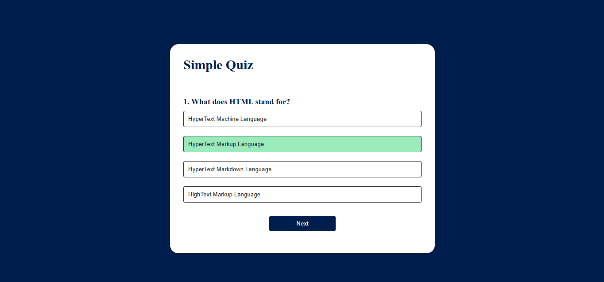
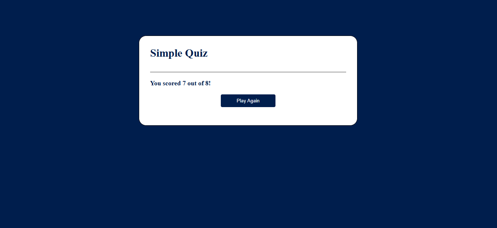

## Simple JavaScript Quiz App
A beginner-friendly quiz application built using HTML, CSS, and JavaScript. It displays multiple-choice questions, highlights correct answers, tracks the score, and allows users to restart the quiz. Perfect for practicing basic web development and JavaScript fundamentals.

## Screenshots

